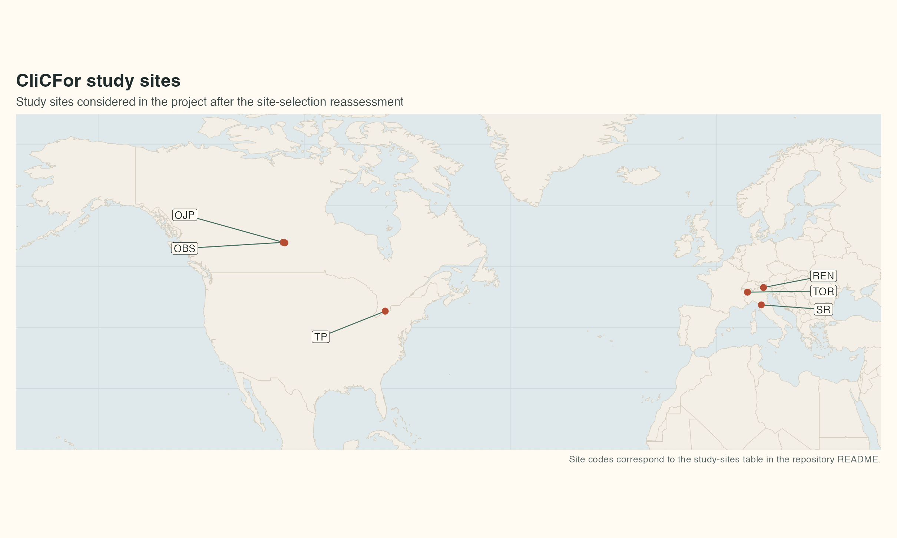

# CliCFor

**CliCFor — Unravelling seasonal to decadal CLImate influence on the Carbon cycle in FORest**

CliCFor investigates how climate variability, extremes, and long‑term trends affect forest carbon cycling across contrasting environments. This repository hosts materials related to the **PRIN 2022 project `2022ETAB7T`** (24 months), combining eddy covariance fluxes, tree‑ring quantitative wood anatomy, stable isotopes, and process‑based modelling to understand when **flux‑based** and **biomass‑based** signals converge or diverge.

---

## Table of contents
- [Status](#status)
- [Project overview](#project-overview)
- [Objectives and key questions](#objectives-and-key-questions)
- [Approach](#approach)
- [Study sites](#study-sites)
- [Research units and roles](#research-units-and-roles)
- [Project participants](#project-participants)
- [Work packages](#work-packages)
- [Model used in the project](#model-used-in-the-project)
- [Data policy and availability](#data-policy-and-availability)
- [Repository structure](#repository-structure)
- [Quick start (RStudio)](#quick-start-rstudio)
- [Dissemination and communication](#dissemination-and-communication)
- [How to cite](#how-to-cite)
- [License](#license)
- [Acknowledgment](#acknowledgment)
- [Contact](#contact)
- [Contributing](#contributing)

---

## Status
🚧 **Active cleanup / progressive update.**  
This repository is being reorganized to improve documentation, data provenance, and reproducible analysis workflows.

- Documentation and initial processed datasets are available.
- Analysis scripts and reusable functions are being added incrementally.
- Some raw datasets (e.g., full eddy covariance exports) may not be redistributed here (see [Data policy](#data-policy-and-availability)).

---

## Project overview
Forest carbon sinks are central to climate‑change mitigation, but the relationship between ecosystem carbon uptake and woody biomass accumulation is still only partially understood. CliCFor was designed to investigate **causal relationships** between climate variability (intra‑seasonal to decadal), primary productivity, and wood biomass formation, and to explain why flux‑based and biomass‑based estimates of forest carbon sequestration may diverge.

CliCFor brings together approaches that are often used separately:
- long eddy covariance time series (fluxes + meteorology)
- tree‑ring quantitative wood anatomy (QWA) and biomass proxies
- stable carbon isotopes (e.g., δ¹³C in earlywood/latewood)
- statistical and process‑based modelling

---

## Objectives and key questions
1. Which climate drivers (temperature, precipitation, VPD, radiation, drought metrics) explain inter‑annual variability in ecosystem carbon fluxes?
2. How do intra‑annual wood formation dynamics respond to climate variability and extremes?
3. When and why do flux‑derived carbon balance and biomass‑derived growth diverge (or align)?
4. Can process‑based models reproduce the observed patterns across sites, and which processes/parameters matter most?

---

## Approach
High‑level components:
- **Eddy covariance** flux processing and analysis (quality control, partitioning, gap filling; daily to multi‑decadal variability)
- **Tree‑ring analyses** including quantitative wood anatomy to reconstruct wood formation/biomass proxies at finer temporal resolution than ring width alone
- **Stable carbon isotopes** (e.g., δ¹³C in earlywood vs latewood) to support physiological interpretations (e.g., intrinsic water‑use efficiency)
- **Integrated modelling** to test causal hypotheses and improve process understanding

---

## Study sites

### Proposal vs actual site selection
The original PRIN proposal described three pure conifer stands under contrasting climates (**OBS** in Canada, **Renon** in Italy, **Yatir** in Israel). During the project, site selection was **reassessed** based on data availability, harmonization, and analysis scope. The table below reports the **study sites actually considered** in the current repository content.

<details>
<summary><b>Study sites table</b> (click to expand)</summary>

| Acronym | Site Name | Country | Lat (°N) | Lon (°) | Elev. (m a.s.l.) | Tree species | MAT (°C) | MAP (mm) | EC time-span | GPP (g C m⁻² yr⁻¹) | QWA time-span |
| --- | --- | --- | ---: | ---: | ---: | --- | ---: | ---: | --- | ---: | --- |
| `OJP` | Old Jack Pine | Canada | 53.916 | -104.692 | 524 | *P. banksiana* | 0.5 | 495 | 1999–2021 | 606 | 1921–2021 |
| `OBS` | Old Black Spruce | Canada | 53.987 | -105.118 | 629 | *P. mariana* | 0.6 | 451 | 1999–2021 | 806 | 1909–2021 |
| `TP`  | Turkey Point | Canada | 42.710 | -80.357 | 184 | *P. strobus* | 8.0 | 997 | 2003–2018 | 1434 | 1957–2019 |
| `REN` | Renon | Italy | 46.587 | 11.434 | 1735 | *P. abies* | 6.0 | 964 | 1999–2020 | 1350 | 1929–2020 |
| `SR`  | San Rossore | Italy | 43.731 | 10.910 | 5 | *P. pinea* | 15.3 | 900 | 2013–2024 | 2651 | 1943–2022 |
| `TOR` | Torgnon | Italy | 45.823 | 7.561 | 2050 | *L. decidua* | 2.9 | 1100 | 2012–2020 | 1322 | 1935–2021 |

**Table notes.**  
- `MAT` = Mean Annual Temperature; `MAP` = Mean Annual Precipitation.  
- `EC time-span` = period with eddy covariance measurements available; `GPP` = mean annual Gross Primary Production; `QWA time-span` = time span covered by xylem anatomical series.  
- Longitude is reported in degrees with East positive (negative values indicate West).

</details>



---

## Research units and roles
- `UNIPD` — University of Padova (PI unit)  
  - Principal Investigator: Daniele Castagneri ([ORCID](https://orcid.org/0000-0002-2092-7415))  
  - Main role: tree‑ring analysis, quantitative wood anatomy, project coordination
- `UNINA` — University of Naples Federico II  
  - Unit lead: Angelo Rita ([ORCID](https://orcid.org/0000-0002-6579-7925))  
  - Main role: integrated data analysis, statistical modelling, process‑based modelling
- `UNIBZ` — Free University of Bozen‑Bolzano  
  - Unit lead: Massimo Tagliavini ([ORCID](https://orcid.org/0000-0002-9585-1726)) / Leonardo Montagnani ([ORCID](https://orcid.org/0000-0003-2957-9071))  
  - Main role: eddy covariance flux analysis and site‑level flux data coordination

---

## Project participants
In addition to the unit leaders, the project involves the following participants and collaborators:
- `UNIBZ` — Free University of Bozen‑Bolzano, Bolzano, Italy: Enrico Tomelleri
- `CNR-ISAFOM` — Forest Modelling Lab., Institute for Agriculture and Forestry Systems in the Mediterranean, National Research Council of Italy, Perugia, Italy: Alessio Collalti; Paulina F. Puchi
- `UNINA` — Department of Agricultural Sciences, University of Naples Federico II, Portici, Italy: Antonio Saracino; Enrica Pinelli; Greta Liuzzi
- `UNIPD` — Department of Land, Environment, Agriculture and Forestry (TESAF), University of Padua, Legnaro, Italy: Giancarlo Genovese

---

## Work packages
- `WP1 — C fluxes`: acquisition, validation, and analysis of long‑term eddy covariance and climate time series
- `WP2 — Tree rings`: sampling, quantitative wood anatomy, stable carbon isotopes, and climate‑growth relationships
- `WP3 — Modelling`: integration of flux, climate, and tree‑ring information; hypothesis testing; refinement of `3D-CMCC-FEM`
- `WP4 — Dissemination & communication`: publications, outreach, metadata, and open science outputs
- `WP5 — Project & data management`: coordination, reproducibility, and data organization

---

## Model used in the project
CliCFor used the process‑based forest model `3D-CMCC-FEM` within the modelling component of the project.

- Project repository used for this work: [angelrita/3D-CMCC-FEM](https://github.com/angelrita/3D-CMCC-FEM)
- Original model repository: [Forest-Modelling-Lab/3D-CMCC-FEM](https://github.com/Forest-Modelling-Lab/3D-CMCC-FEM)

---

## Data policy and availability

### What is stored in this repository
- Project documentation (`docs/`)
- Processed/derived products prepared for analysis (see `data/processed/`)
- Dataset metadata and notes (see `data/metadata/`)
- Scripts and reusable code (as they become available; `scripts/` and `src/`)

### What is *not* necessarily stored here
- Full raw eddy covariance exports, large model outputs, and/or third‑party data that cannot be redistributed.
- Credentials, private keys, or any sensitive material.

When data are not redistributed, this repository aims to provide:
- clear provenance and access notes in `data/metadata/`
- scripts that can rebuild derived products when access is granted

---

## Acknowledgment
This project was supported by the National Recovery and Resilience Plan (PNRR), Mission 4, Component 2, Investment 1.1, Call for tender No. 104 published on 2.2.2022 by the Italian Ministry of University and Research (MUR), funded by the European Union - NextGenerationEU - Project Title "CliCFor" - CUP C53D23005270001 - Grant Assignment Decree No. 2022ETAB7T adopted on 14/07/2023 by the Italian Ministry of University and Research (MUR).

## License
- Code: MIT (see `LICENSE`)
- Documentation: CC BY 4.0 (see `LICENSE-DOCS.md`)
- Data products: CC BY 4.0 unless otherwise stated (see `LICENSE-DATA.md` and `data/metadata/`)

## Repository structure
```text
CliCFor/
|- docs/                              project notes and documentation
|- data/
|  |- raw/                            original data files kept unchanged (if redistributed)
|  |- processed/                      derived datasets ready for analysis
|  |  `- xylem_anatomy_chronologies/  chronology files currently versioned here
|  `- metadata/                       codebooks, notes, dataset descriptions
|- scripts/                           analysis scripts and workflow steps
|- src/                               reusable R functions
|- outputs/
|  |- figures/                        generated plots
|  `- tables/                         generated tables
|- CliCFor.Rproj
`- README.md

